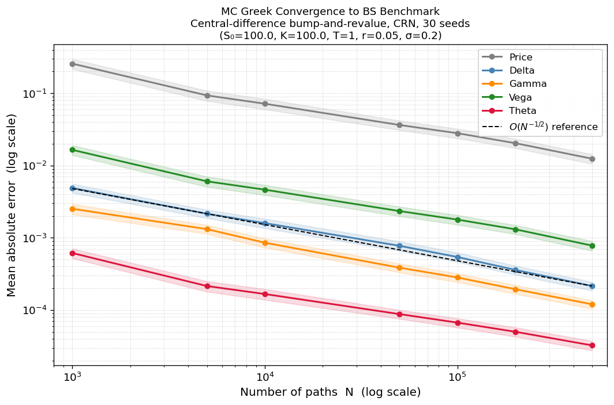
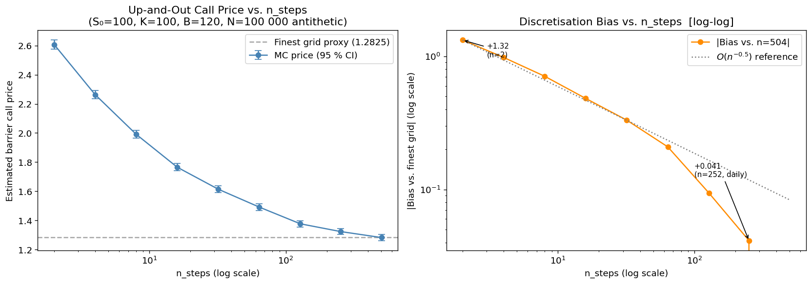
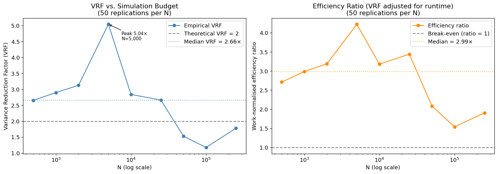
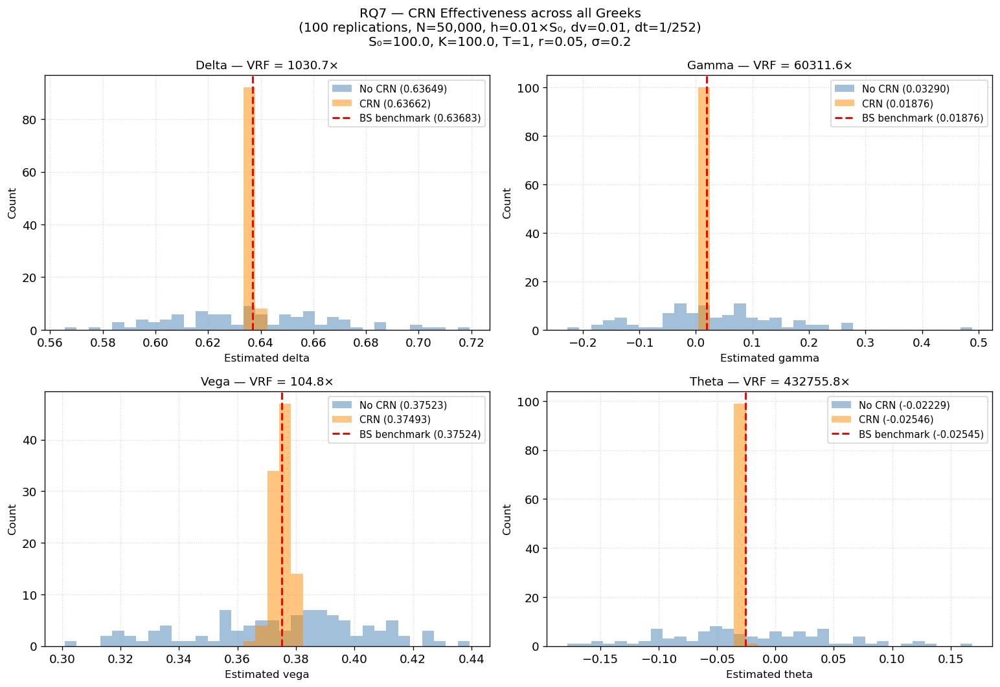
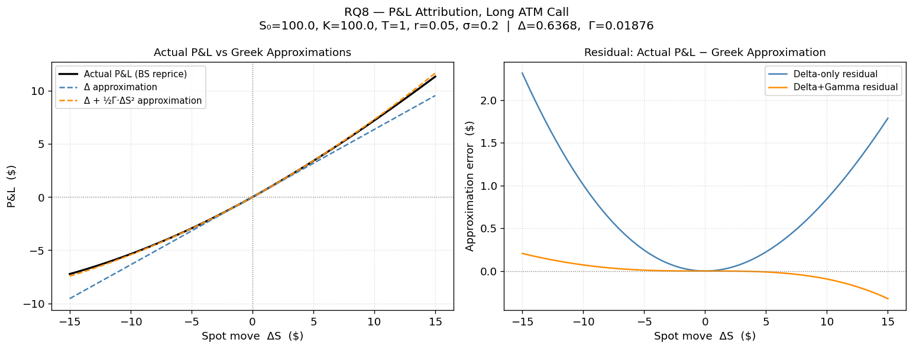

# Monte Carlo Methods for Derivative Pricing, Greeks Estimation, and Variance Reduction

## Overview

A Python library for Monte Carlo option pricing, finite-difference Greeks, and variance reduction analysis under the Black-Scholes model — built as a quantitative research project with reproducible experiments, statistical validation, and a full pytest suite.

The goal is to demonstrate practical skills relevant to quantitative finance roles: derivatives pricing, numerical methods, statistical validation, model risk analysis and Python-based quantitative tooling.

## Features

- Analytical Black-Scholes pricing for European calls and puts
- Analytical Black-Scholes Greeks (Delta, Gamma, Vega, Theta, Rho)
- Monte Carlo pricing for European options
- Finite-Difference Greeks (CRN) Bump-and-revalue Delta/Gamma/Vega via central differences; Theta via one-trading-day time decay.
- Confidence intervals and convergence analysis
- Variance reduction with antithetic variates
- Statistical metrics per experiment: absolute error, relative error, standard error, confidence intervals, runtime
- Barrier option pricing
- Unit tests with pytest

## Why this project matters

This project demonstrates core building blocks of quantitative finance: stochastic simulation, derivatives pricing, numerical convergence, statistical confidence intervals, variance reduction and model validation against analytical benchmarks.

It is designed as an educational quantitative finance library, not as a production front-office pricing system.

## Research Questions

1. **Convergence** — How does the MC pricing error scale with simulation budget *N*?
   Does the observed *O(N^{-1/2})* rate hold in practice?
2. **Variance Reduction** — How much does antithetic sampling reduce estimator variance
   for European and barrier options, and what is the efficiency gain per unit of compute?
3. **Confidence Interval Coverage** — Do the 95 % asymptotic CIs based on the CLT achieve
   their nominal coverage across a realistic parameter grid?
   CI coverage results (91–93% empirical vs 95% nominal) available in research_demo.ipynb.
4. **Discretisation Bias in Barrier Options** — How does path resolution (number of time
   steps) affect the knock-out probability and the resulting pricing bias?
5. **MC Greek Convergence** — Do finite-difference MC Greeks converge to analytical BS Greeks
   at the expected O(N⁻¹/²) rate, and what simulation budget is required for each Greek?
6. **Common Random Numbers** — How much does CRN reduce variance in bump-and-revalue Greeks,
   and is it strictly necessary for second derivatives like Gamma?
7. **P&L Attribution** — How accurately do Delta and Delta+Gamma Taylor expansions track
   option P&L across a range of spot moves?

## Methods Implemented

| Method | Description |
|---|---|
| Black-Scholes (analytical) | Closed-form price for European calls and puts |
| Standard Monte Carlo | i.i.d. GBM terminal-price simulation |
| Finite-Difference Greeks | Bump-and-revalue Delta/Gamma/Vega via central differences; Theta via one-trading-day time decay |
| Antithetic Variates | Paired ±Z draws; cuts variance roughly in half for smooth payoffs |
| Common Random Numbers (CRN) | Same random seed reused across base and bumped pricing calls; cancels correlated noise in finite-difference Greeks (VRF up to ~430,000× for Theta) |
| Path Simulation | Full GBM path discretisation for path-dependent contracts |
| Barrier Options | Up-and-out / down-and-out knock-out payoffs |

## Tech Stack

- Python ≥ 3.10
- NumPy — vectorised simulation
- SciPy — normal CDF, statistical utilities
- Pandas — structured experiment outputs
- Matplotlib — convergence and bias plots
- pytest — reproducibility tests

## Project Structure

```text
monte-carlo-option-pricing/
├─ pyproject.toml
├─ README.md
├─ .gitignore
├─ src/
│  ├─ option_pricing/           # Core library
│  │  ├─ __init__.py
│  │  ├─ black_scholes.py       # Analytical BS prices and Greeks (8 + 2 functions)
│  │  ├─ monte_carlo.py        # Simulation engine + finite-difference MC Greeks (CRN)
│  │  └─ utils.py              # Statistical helpers, convergence table
│  └─ research/                # Reproducible research experiments
│     ├─ __init__.py
│     └─ experiments.py        # Seven reproducible experiment functions (Exp 1–7)
├─ tests/
│  ├─ test_black_scholes.py   # 30 tests: exact reference + properties + edge cases
│  └─ test_monte_carlo.py      # 18 tests: pricing, barrier, Greeks, experiments
├─ notebooks/
│  ├─ research_demo.ipynb      # Vanilla pricing experiments (convergence, VR, CI, bias)
│  └─ research_demo_greeks.ipynb # MC Greek estimation + P&L attribution
├─ foundations/                # Educational notebooks on theory
└─ reports/
   ├─ figures/
```

## Notebooks

**`research_demo.ipynb`** — Core experiments: convergence at O(N⁻¹/²), variance reduction effectiveness (antithetic VRF ≈ 2.66×), CI coverage (91–93 % empirical vs 95 % nominal), and discretisation bias in barrier options (O(1/√n_steps) convergence).

**`research_demo_greeks.ipynb`** — Seven experiments on finite-difference Greek estimation: Greek profiles vs spot and maturity, convergence to BS benchmarks under antithetic vs plain MC, log-log convergence rate, bump size sensitivity across multiple orders of magnitude, CRN effectiveness (VRF up to 400 000× for Theta), and P&L attribution using Delta + ½Γ·ΔS² Taylor expansion.

## Quickstart

```python
from option_pricing import (
    bs_call_price,
    mc_european_option_price,
    mc_european_option_greeks,
)
from research.experiments import run_convergence_experiment

# Analytical benchmark
price = bs_call_price(S0=100, K=100, T=1, r=0.05, sigma=0.2)

# Monte Carlo estimate with antithetic variates
result = mc_european_option_price(
    S0=100, K=100, T=1, r=0.05, sigma=0.2,
    option_type="call", n_paths=100_000, antithetic=True, random_seed=42,
)
print(f"MC price: {result.price:.4f}  SE: {result.standard_error:.4f}")

# Finite-difference Greeks via Common Random Numbers
greeks = mc_european_option_greeks(
    S0=100, K=100, T=1, r=0.05, sigma=0.2,
    option_type="call", n_paths=200_000, random_seed=42,
)
print(f"Delta: {greeks.delta:.4f}, Gamma: {greeks.gamma:.6f}, Vega: {greeks.vega:.4f}, Theta: {greeks.theta:.4f}")

# Convergence experiment
df = run_convergence_experiment()
print(df.to_string(index=False))
```

## Key Results

All experiments are reproducible from `src/research/experiments.py` and the two demo 
notebooks. Base parameters unless noted: S₀ = K = 100, T = 1 yr, r = 5 %, σ = 20 %. 
Analytical Black-Scholes benchmark:
European call price: **10.4506**
European call delta: **0.636831**
European call theta: **−0.025452**
European gamma: **0.018762**
European vega: **0.375240**
Put-call parity residual: **0.00e+00**

---

### 1 · Convergence — Pricing and Greeks at O(N⁻¹/²)

Standard MC theory predicts an O(N⁻¹/²) convergence rate for both option prices and 
finite-difference Greeks. This is verified empirically by tracking mean absolute 
error against analytical Black-Scholes benchmarks across simulation budgets from 
N = 1,000 to N = 500,000, with multiple independent seeds at each budget. The 
log-log regression below shows the seed-averaged MAE for the call price and all 
four Greeks (Delta, Gamma, Vega, Theta).



All five quantities align with the dashed O(N⁻¹/²) reference line: the convergence 
rate is identical, with only the prefactor (vertical offset) differing between them. 
The vertical ordering reflects each quantity's scale — a Greek of order 10⁻² produces 
a smaller absolute error than one of order 1 at the same relative precision. 
Independent log-log OLS slopes on the call price across 50 seeds (notebook 1 - experiment 1) yield 
−0.45 ± 0.23 for the antithetic estimator and −0.46 ± 0.25 for standard MC, both 
statistically consistent with the theoretical −0.50.

At N = 500,000, all four Greek mean absolute errors fall below 10⁻³, and the call price MAE falls to ≈ 1.3 × 10⁻² (≈ 0.13% relative error).

---

### 2 · Discretisation Bias — Up-and-Out Barrier Option

Barrier options cannot be priced from the terminal stock price alone — the full 
trajectory must be simulated to check whether the barrier is crossed. In practice, 
paths are simulated on a discrete time grid of n_steps monitoring points, and 
crossings between grid points are missed. Sparse grids systematically under-count 
knock-out events and therefore **overstate** the option price; refining the grid 
converges the discrete-monitoring price toward the continuous-monitoring price at 
the known O(1/√n_steps) rate.



This experiment prices an up-and-out call (S₀ = K = 100, B = 120, T = 1 yr, r = 5 %, 
σ = 20 %) using 100,000 antithetic paths across nine resolutions from semi-annual 
(n_steps = 2) to twice-daily (n_steps = 504). At n_steps = 2 the price is **2.6069**, 
more than double the finest-grid estimate of **1.2825** — an overstatement of **+103 %**. 
Bias drops by a factor of √2 ≈ 0.71 each time n_steps doubles, consistent with the theoretical O(1/√n_steps) rate.
By n_steps = 252 (daily monitoring) bias has collapsed to +3 %.

| n_steps | MC Price | Bias vs. n = 504 | Bias % |
|--------:|---------:|-----------------:|-------:|
| 2       | 2.6069   | +1.3244          | +103 % |
| 8       | 1.9908   | +0.7083          | +55 %  |
| 32      | 1.6142   | +0.3317          | +26 %  |
| 128     | 1.3769   | +0.0944          | +7 %   |
| **504** | **1.2825** | **—**          | **—**  |

**Operational implication:** practitioners using weekly or monthly monitoring grids 
for barrier products should expect a material upward pricing bias; daily or 
sub-daily grids are required for reliable estimates.

---

### 3 · Variance Reduction Methods

Two variance reduction techniques are implemented and benchmarked in this project. 
Both carry **zero compute overhead** — they are seed and draw-management choices, 
not resource tradeoffs. Their effectiveness, however, is calibrated to very 
different problems: antithetic variates deliver a modest ~2× gain on smooth 
European payoffs, while Common Random Numbers (CRN) deliver up to **~400 000×** 
variance reduction on finite-difference Greeks.

#### 3A · Antithetic Variates — European Options

Antithetic variates pair each draw Z with its mirror −Z, producing negatively 
correlated path pairs whose payoffs partially cancel each other's noise. For 
smooth, monotone payoffs such as European calls, the theoretical Variance 
Reduction Factor (VRF) approaches 2× as the payoff-to-draw correlation 
approaches −1.



Empirically, across 50 independent replications per budget, the **median VRF 
is 2.66×** with a peak of **5.04× at N = 5,000**. At very large N, both estimator variances become small, making empirical VRF estimates noisy with only 50 replications. 
The apparent compression toward 1× should therefore be interpreted cautiously.

| N        | Var (Standard) | Var (Antithetic) | VRF    |
|---------:|---------------:|-----------------:|-------:|
| 1,000    | 0.2371         | 0.0819           | 2.90×  |
| 5,000    | 0.0568         | 0.0113           | **5.04×** |
| 25,000   | 0.0086         | 0.0032           | 2.66×  |
| 100,000  | 0.0016         | 0.0014           | 1.17×  |

**Median VRF: 2.66× · Median efficiency ratio: 2.99×**

#### 3B · Common Random Numbers — Finite-Difference Greeks

Finite-difference Greeks subtract near-equal MC prices, so the signal (the true 
derivative) is small relative to the independent sampling noise of order σ/√N. 
With CRN — reusing the same random seed across the base and all bumped pricing 
calls — the same paths experience the parameter bump, the noise is fully 
correlated, and it cancels in the difference, leaving only the true sensitivity.



Across 100 replications at N = 50,000, the empirical VRF reaches **1,031× for 
Delta, 105× for Vega, 60,312× for Gamma, and 432,756× for Theta**. 
Without CRN, Gamma estimates scatter from −0.2 to +0.5 against a true value of 0.01876, and Theta
estimates scatter from −0.17 to +0.17 against a true value of −0.02545 — essentially pure noise
relative to the signal.
Theta shows the most extreme VRF because two effects compound: its numerator subtracts 
prices at nearly identical maturities (smallest signal of any Greek), and the 
result is divided by dt ≈ 1/252, amplifying residual noise by 252×.

| Greek | True BS Value | VRF (CRN vs no CRN) |
|-------|--------------:|--------------------:|
| Delta | 0.6368        | 1,031×              |
| Vega  | 0.3752        | 105×                |
| Gamma | 0.01876       | 60,312×             |
| Theta | −0.0255       | **432,756×**        |

**Practical conclusion:** no risk system should compute finite-difference Greeks 
without CRN, and antithetic variates should be enabled by default for vanilla 
European option pricing at moderate path counts.

---

### 4 · P&L Attribution — Delta-Gamma Taylor Expansion

Daily option P&L is explained in practice by the Greek-based Taylor expansion 
ΔP&L ≈ Δ·ΔS + ½Γ·ΔS² + V·Δσ + Θ·Δt. This experiment bridges Greek estimation to 
that practical task by repricing a long ATM call under Black-Scholes at new spot 
levels (ΔS from −15 to +15) and comparing the actual P&L against two Greek-based 
approximations: a first-order Delta-only model and a second-order Delta+Gamma model.



The Delta-only approximation misses the option's convexity: its residual grows 
quadratically with ΔS, reaching **~$2** at a ±$15 spot move (~13 % of the move size). 
Adding the ½Γ·ΔS² term captures nearly all the curvature, keeping the residual 
**below $0.3** even at the largest moves — a roughly **7× reduction** in unexplained 
P&L. The small asymmetry that remains in the Delta+Gamma residual (positive for 
down-moves, negative for up-moves) signals the next-order term (Speed = ∂Γ/∂S), 
which only becomes detectable at large moves.

| Approximation              | Residual at ΔS = ±15 | % of spot move |
|----------------------------|---------------------:|---------------:|
| Δ·ΔS  (Delta only)         | ~$2.0                | ~13 %          |
| Δ·ΔS + ½Γ·ΔS²  (D + G)     | ~$0.3                | ~2 %           |

This is the empirical foundation for Delta-Gamma hedging in practice: Delta and 
Gamma together explain the bulk of daily option P&L, and the residual is the 
"unexplained" bucket attributed to Vega, Theta, and higher-order sensitivities.


## Roadmap

1. **Implied volatility solver** — Brent's method to invert Black-Scholes and 
   recover implied vols from market option prices
2. **Real market data** — SPY option chains via yfinance, implied volatility 
   smile, analytical Greeks on real strikes
3. **Historical P&L attribution** — extend Experiment 7 to a real one-month 
   SPY position using daily market moves
4. **Historical VaR with Kupiec backtest** — 99% one-day VaR on an option 
   portfolio, validated under Basel traffic-light criteria


## Installation

**Minimal usage (no Poetry):**

```bash
mamba env create -f environment.yml
mamba activate monte-carlo
jupyter lab
```

**Full dev workflow:**

```bash
mamba activate monte-carlo
poetry install --with dev
poetry run pytest
```